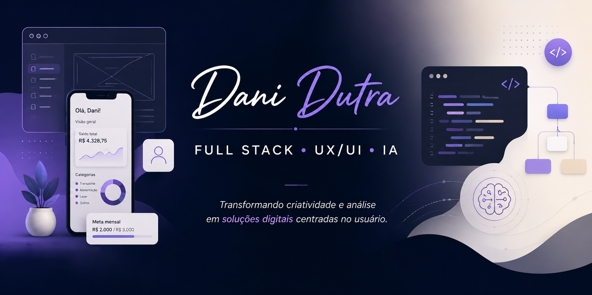
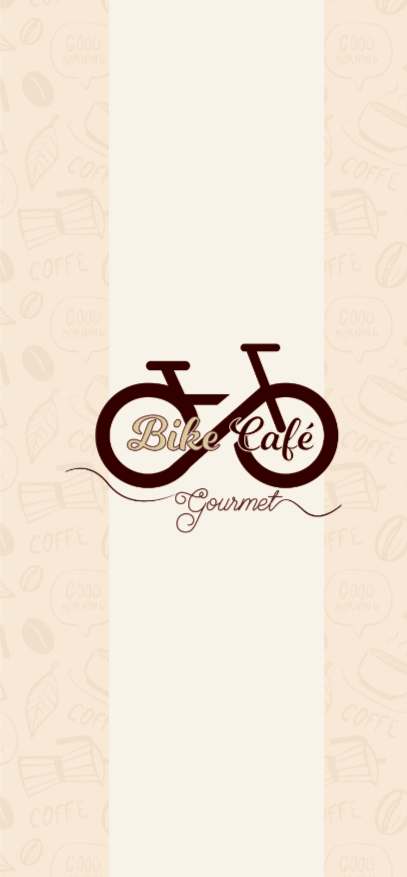

<p align="center">
  
</p>

# Olá, eu sou a Dani Dutra! 👩‍💻

Desenvolvedora Full Stack em formação • UX/UI • Tecnologia & Produto

💡 Transformando criatividade e análise em soluções digitais.

- 🎓 Estudante de Análise e Desenvolvimento de Sistemas (ADS)
- 🚀 Formação DEV Full Stack — +praTi & Codifica
- 📚 Bootcamps e projetos práticos na DIO

---

✨ Sobre mim

Sou estudante de Análise e Desenvolvimento de Sistemas e formada em Artes Digitais, construindo minha trajetória na interseção entre tecnologia, experiência do usuário e desenvolvimento de produtos digitais.

Minha experiência em design fortaleceu meu olhar para usabilidade, comunicação visual e resolução de problemas. Atualmente, venho ampliando essa base por meio do desenvolvimento Full Stack, explorando a criação de aplicações, banco de dados, inteligência artificial e soluções centradas no usuário.

Tenho interesse especial em projetos que conectem tecnologia, produto, UX/UI e IA, transformando ideias em experiências digitais funcionais e relevantes.

---

## 🚀 Atualmente estudando e construindo

```txt
▸ Desenvolvimento Full Stack
▸ React & aplicações web
▸ JavaScript e React
- Node.js
▸ Python para lógica e dados
▸ PostgreSQL & bancos relacionais
▸ Inteligência Artificial aplicada a produtos digitais
▸ UX/UI & experiência do usuário
▸ Metodologias Ágeis
```

---

## 🛠️ Tech Stack

### 💻 Desenvolvimento

<p align="left">
  
</p>

---

🎨 Design & Produto

UX/UI • Design Thinking • Adobe XD • Arquitetura da Informação • Prototipação

--- 

📊 Dados & Análise

Python • PostgreSQL • Looker Studio • Análise de Dados

---

## 📌 Projetos em Destaque

### 💰 Grana.ai — Assistente Financeiro com IA

Aplicação de finanças pessoais desenvolvida com foco em organização financeira, experiência do usuário e exploração de ferramentas de IA para prototipação e validação de produto.

**Tecnologias:** IA Generativa • Lovable • UX/UI • Produto Digital

🌐 **Demo Online**
https://grana-ai-assistente.lovable.app/

📂 **Repositório**
https://github.com/danieli-dutra/grana-ai-finance-assistant

📈 **Status:** Em evolução para desenvolvimento e manutenção direta em código.

---

### 🌱 EcoTrip — Calculadora de CO₂

Calculadora de emissão de CO₂ voltada à conscientização ambiental, incentivando escolhas mais sustentáveis através de estimativas de impacto.

**Tecnologias:** HTML • CSS • JavaScript

📂 **Repositório**
https://github.com/danieli-dutra/ecotrip-calculadora-co2

🌐 **Aplicação Online**
https://danieli-dutra.github.io/ecotrip-calculadora-co2/

---

### 🚲 Bike Café Gourmet — UX/UI Case

<p align="center">
  
</p>

Projeto acadêmico de UX/UI Design focado na criação de uma experiência digital para uma cafeteria temática voltada ao universo do ciclismo.

**Tecnologias:** Adobe XD • UX/UI • Design Thinking • Prototipação

📂 **Repositório**
https://github.com/danieli-dutra/bike-cafe-gourmet-project

💻 **Protótipo Desktop**
https://xd.adobe.com/view/5f696a25-8a97-452d-498f-3ae0b0bf2828-2958/

📱 **Protótipo Mobile**
https://xd.adobe.com/view/b60a37e1-dfdb-4553-6ae8-94faa6243c10-c03b/?fullscreen&hints=off

---

### 🎨 D2B Gourmet — Branding, Design System & IA

Projeto que conecta branding, identidade visual e inteligência artificial, explorando a construção de marca, documentação visual e aplicações voltadas para produto digital.

**Tecnologias:** Branding • Design System • IA • Design de Produto

📂 **Branding & Design System**
https://github.com/danieli-dutra/d2b-gourmet-branding-design-system

🤖 **Agente de Vendas com IA**
https://github.com/danieli-dutra/d2b-gourmet-agente-vendas

---

### 🐍 Python, Dados & Insights

Projetos voltados para lógica de programação, manipulação de dados e geração de insights através de análises exploratórias e visualização de informações.

**Tecnologias:** Python • Análise de Dados • Looker Studio

📂 **Projetos em Python**
https://colab.research.google.com/drive/1aIekZlYS6jKqa7BbYCBlPHq_ZYt7SWDt?usp=sharing

📊 **Dashboard Interativo**
https://datastudio.google.com/reporting/cec2becd-49c3-4d0b-a0ea-a1fab1c71b87

---


## 🌎 Onde me encontrar

💼 **LinkedIn**
https://www.linkedin.com/in/danieli-dutra/

🚀 **DIO**
https://web.dio.me/users/danieli_dutra1/?tab=achievements

---

✨ *Sempre aprendendo, construindo e evoluindo.*


