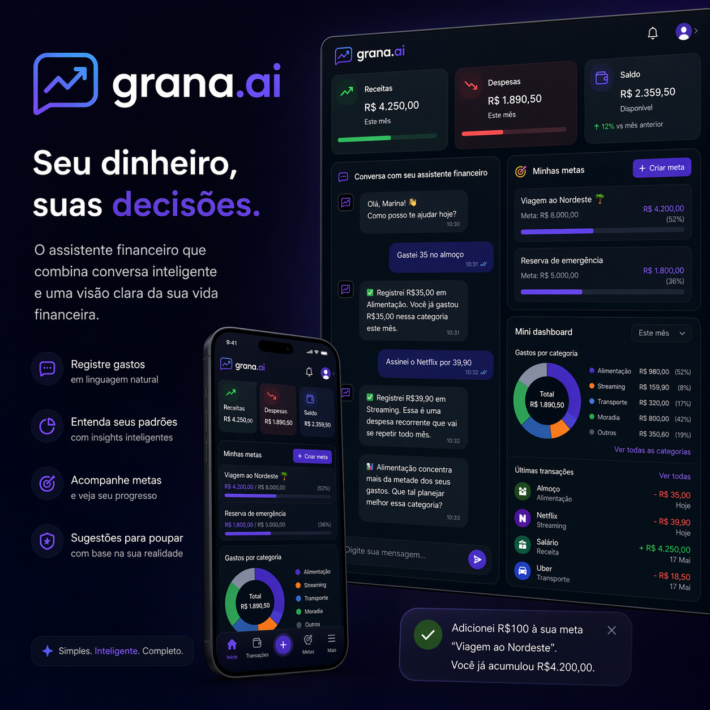
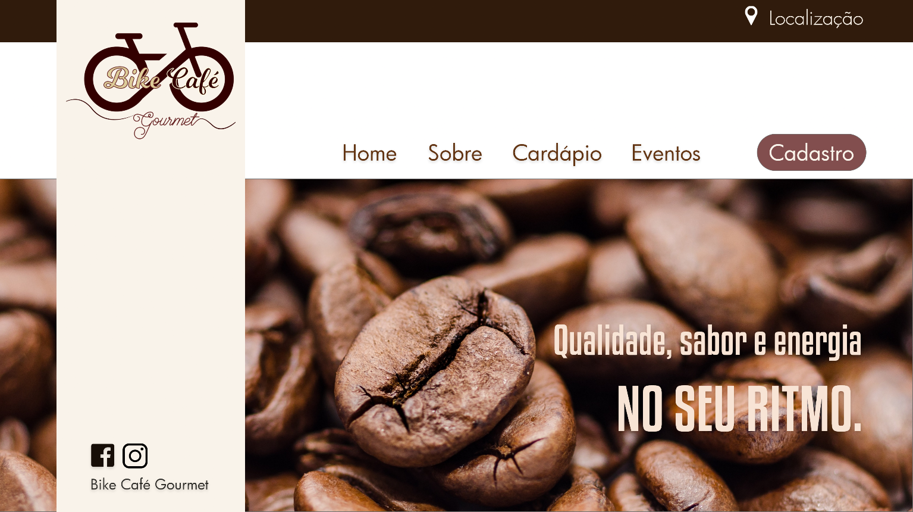

<p align="center">
  
</p>

# Olá, eu sou a Dani Dutra! 👩‍💻

**Desenvolvedora Full Stack em formação • UX/UI • Tecnologia & Produto • IA Conversacional**

💡 Construindo produtos digitais que unem tecnologia, design e inteligência artificial para resolver problemas reais.

- 🎓 Estudante de Análise e Desenvolvimento de Sistemas (ADS)
- 🚀 Formação Full Stack — +praTi & Codifica
- 📚 Bootcamps e projetos práticos na DIO
- 💰 Desenvolvendo o **Grana.ai** como principal projeto da minha formação

---

✨ Sobre mim

Sou estudante de Análise e Desenvolvimento de Sistemas, formada em Artes Digitais e apaixonada por construir produtos digitais.

Minha trajetória começou pelo design, onde desenvolvi uma forte base em experiência do usuário, comunicação visual e resolução de problemas. Hoje amplio essa visão através do desenvolvimento Full Stack, explorando arquitetura de software, aplicações web, bancos de dados e inteligência artificial aplicada a produtos.

Tenho interesse especial por projetos que unem **engenharia de software, UX, produto e IA**, buscando criar experiências simples, úteis e escaláveis.

---

## 🚀 Atualmente estudando e construindo

```txt
▸ Desenvolvendo o Grana.ai (Projeto Final +praTi & Codifica)
▸ React & TypeScript
▸ JavaScript
▸ Node.js
▸ Python para lógica e dados
▸ PostgreSQL & Supabase
▸ Arquitetura Full Stack
▸ Inteligência Artificial Conversacional
▸ UX/UI & experiência do usuário
▸ Metodologias Ágeis
▸ Git, GitHub e boas práticas de desenvolvimento
```

---

## 🛠️ Tech Stack

### 💻 Desenvolvimento

<p align="left">
  
</p>

---

### 🎨 Design & Produto

UX/UI • Design Thinking • Adobe XD • Arquitetura da Informação • Prototipação

--- 

### 📊 Dados & Análise

Python • PostgreSQL • Looker Studio • Análise de Dados

---

## 📌 Projetos em Destaque

# 💰 Grana.ai — AI Financial Assistant

> Um assistente financeiro conversacional que transforma linguagem natural em organização financeira, unindo inteligência artificial, UX e desenvolvimento Full Stack.



O **Grana.ai** é o principal projeto do meu portfólio e também o projeto final da minha formação em Desenvolvimento Full Stack.

A proposta é tornar o controle financeiro mais simples e natural: em vez de preencher formulários ou planilhas, o usuário conversa com o sistema como faria com uma pessoa.

A partir dessas conversas, o aplicativo interpreta a intenção do usuário, organiza automaticamente receitas, despesas e metas financeiras, identifica padrões de comportamento e gera recomendações contextualizadas.

### ✨ Destaques

- 💬 Registro financeiro por linguagem natural
- 🧠 IA conversacional com regras determinísticas
- 📊 Dashboard financeiro integrado
- ❤️ Score de Saúde Financeira contextual
- 🎯 Metas financeiras e acompanhamento de progresso
- 🔁 Detecção de recorrências e memória contextual
- 🎨 UX focada em reduzir a fricção no controle financeiro

### 🛠️ Stack

`React` • `TypeScript` • `Supabase` • `Vite` • `Conversational AI` • `Product Thinking` • `UX/UI`

### 🚧 Roadmap

- Migração para arquitetura Full Stack (Spring Boot + PostgreSQL)
- API REST própria
- Testes automatizados
- Validação com usuários
- Evolução para um SaaS

## Links

📂 Código-fonte
- https://github.com/danieli-dutra/grana-ai

📋 Documentação
- (em breve)

🚀 Deploy
- (em breve)

📈 **Status**
- Projeto em desenvolvimento ativo • Projeto Final da Formação Full Stack (+praTi & Codifica)

---

### 🌱 EcoTrip — Calculadora de CO₂

Calculadora de emissão de CO₂ voltada à conscientização ambiental, incentivando escolhas mais sustentáveis através de estimativas de impacto.

**Tecnologias:** HTML • CSS • JavaScript

 


📂 **Repositório**
https://github.com/danieli-dutra/ecotrip-calculadora-co2

🌐 **Aplicação Online**
https://danieli-dutra.github.io/ecotrip-calculadora-co2/

---

### 🚲 Bike Café Gourmet — UX/UI Case

Projeto acadêmico de UX/UI Design focado na criação de uma experiência digital para uma cafeteria intinerante.

**Tecnologias:** Adobe XD • UX/UI • Design Thinking • Prototipação

<div style="display: flex; gap:100px; align-items: flex-start;">

  

  

</div>

📂 **Repositório**
https://github.com/danieli-dutra/bike-cafe-gourmet-project

💻 **Protótipo Desktop**
https://xd.adobe.com/view/5f696a25-8a97-452d-498f-3ae0b0bf2828-2958/

📱 **Protótipo Mobile**
https://xd.adobe.com/view/b60a37e1-dfdb-4553-6ae8-94faa6243c10-c03b/?fullscreen&hints=off

---

### 🎨 D2B Gourmet — Branding, Design System & IA

Projeto que conecta branding, identidade visual e inteligência artificial, explorando a construção de marca, documentação visual e aplicações voltadas para produto digital.

**Tecnologias:** Branding • Design System • IA • Design de Produto

📂 **Branding & Design System**
https://github.com/danieli-dutra/d2b-gourmet-branding-design-system

🤖 **Agente de Vendas com IA**
https://github.com/danieli-dutra/d2b-gourmet-agente-vendas

---

### 🐍 Python, Dados & Insights

Projetos voltados para lógica de programação, manipulação de dados e geração de insights através de análises exploratórias e visualização de informações.

**Tecnologias:** Python • Análise de Dados • Looker Studio

📂 **Projetos em Python**
https://colab.research.google.com/drive/1aIekZlYS6jKqa7BbYCBlPHq_ZYt7SWDt?usp=sharing

📊 **Dashboard Interativo**
https://datastudio.google.com/reporting/cec2becd-49c3-4d0b-a0ea-a1fab1c71b87

---


## 🌎 Onde me encontrar

💼 **LinkedIn**
https://www.linkedin.com/in/danieli-dutra/

🚀 **DIO**
https://web.dio.me/users/danieli_dutra1/?tab=achievements

---

> *"Gosto de transformar ideias em produtos digitais. Hoje meu foco está em construir aplicações Full Stack que combinem engenharia, UX e inteligência artificial para resolver problemas reais."*


